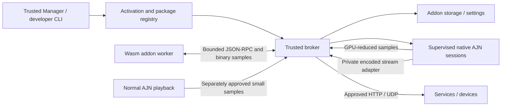

# Combined addon architecture

The June proposals provide useful product structure: a host independent of Manager's window, isolated addon lifetimes, declarative UI, activation sources, package metadata, and developer replay. The implementation adopts those ideas and replaces unrestricted addon service executables with portable Wasm workers. JavaScript is the first SDK; JSON-RPC and capability semantics remain language-independent.

Solid connections exist in the developer foundation and companion Manager branch. The persistent host exposes trusted management over a Windows named pipe. Native sessions, SDR DirectML samples, normal-player observations, scoped HTTP/UDP and owned encoded HTTP outputs are integrated. The CLI and service use the same package, grant, settings, broker, and worker classes.

The management pipe permits its Windows owner and explicitly denies network logons. The complete ACL is applied at creation, and the initial listener uses FirstPipeInstance. Both ends verify ownership. The host holds an exclusive data-directory lease; eight management connections share its addon controllers, and list responses are paginated. Manager commands are never exposed on a guest worker's channel. See [MANAGEMENT.md](MANAGEMENT.md).

## Ownership

One activation controller manages one addon ID. Each manager window, player, or manual request contributes a distinct activation key; repeated acquisition of the same key does not start duplicate workers. Releasing the last key sends a bounded stop event and closes the worker. A one-shot declared action temporarily starts an inactive addon. Crashed workers are not endlessly restarted: recovery is an explicit controller stop/reacquire.

The worker's broker owns its granted permissions and session owner. It never accepts an addon ID or permission set from a guest RPC call. Provider calls do not hold the registry-wide lock. Per-session gates serialize operations on that session while other sessions remain usable. Pending opens reserve capacity and are cancelled when the owner closes. Failed session close retains its entry/capacity rather than claiming the resource was released.

Each worker is a verified native Wasmtime runtime behind a small trusted launcher. The launcher waits for a gate byte until the parent has attached its Windows Job Object. Wasmtime then inherits that job. Closing the job terminates descendants if the host itself crashes; normal supervision explicitly terminates the job and waits for it to empty before removing temporary files. A short bounded retry handles delayed Windows directory-handle release.

## Data and updates

Installed code is stored by package digest. `active.json` selects the current and previous code/grant pairs, and is replaced atomically after package validation. Settings and private storage live in separate per-addon directories and are not part of the package. The host checks for directory links/junctions and never extracts arbitrary package paths or runs installation scripts.

This boundary assumes the OS account, AJN host, verified sandbox runtime, and native providers are trusted. Checks for links are defense in depth, not a claim that an already-compromised same-user native process can be contained by pathname checks. Addons themselves receive no direct filesystem or process-launch capabilities.

Automatic catalog updates must eventually bind publisher identity, addon ID, version, artifact digest, and approval. A package digest alone is not a publisher signature. Permission expansion and publisher changes must never inherit consent silently. User data remains under host ownership across uninstall/update/rollback, with explicit future migration and reset policies.

## Media and networking

Keep inference, decoding, frame ownership, sampling/downscaling, encoding, and GPU synchronization in trusted native components. Addon code must not run in the render callback. Control messages can use JSON; continuous pixels or encoded media require a separately bounded binary transport with ownership, cancellation, and backpressure rules.

The private output adapter retains the upstream hardware frame pool and sends encoded bytes over an unnamed pipe to the trusted host. It supports audio/muxing and backpressures only its own producer. The versioned guest controls bind each output to an owned session, approved source/profile and receiver; continuous bytes stay out of Wasm. [OUTPUTS.md](OUTPUTS.md) describes consent, delivery and cleanup; [NATIVE-OUTPUT.md](NATIVE-OUTPUT.md) covers the native path and hardware limitations.

The first real producer negotiates processed BGRA8 SDR samples up to 320x180 and 60 Hz. Its private D3D11 filter preserves the original frame, retains at most one sample source through GPU completion, and skips when busy. An unnamed mapping connects only the trusted native worker and host; validated binary copies reach Wasm. Subscription ownership follows session ownership, seeks invalidate old epochs, and unsubscribe/close disables capture. Host timers serialize periodic callbacks and coalesce missed ticks. Post-filter frames are not automatically the final tone-mapped, subtitle-composited display image. [FRAMES.md](FRAMES.md) records the exact semantics and remaining format limits.

Network permissions use user-selected destinations, protocols and limits. HTTP/UDP adapters pin reviewed addresses and enforce ownership, cancellation and bounded payloads. HTTP header credentials use Windows DPAPI and their approved service. Wasm remains without general network access. Other transports and listening/discovery need separate capabilities and consent. See [NETWORK.md](NETWORK.md). Earlier proposals' fixed localhost ports, single Plex stream and external configuration executables are not platform requirements.

## Sources used for runtime design

- [Wasmtime security model](https://docs.wasmtime.dev/security.html): host-provided imports and WASI capability access.
- [JSON-RPC specification](https://www.jsonrpc.org/specification): standard request, result, and error envelopes.
- [Windows job termination](https://learn.microsoft.com/en-us/windows/win32/api/jobapi2/nf-jobapi2-terminatejobobject) and [job accounting](https://learn.microsoft.com/en-us/windows/win32/api/winnt/ns-winnt-jobobject_basic_accounting_information): lifetime supervision and active-process accounting.
- [AppContainer isolation](https://learn.microsoft.com/en-us/windows/win32/secauthz/appcontainer-isolation): possible later OS-level defense for the runtime process.

## Optional scene decision bridge (API 1.8)

The scene registry grants one addon exclusive control of RIFE scene decisions per
normal player. Only trusted host/player processes map the owner-only Windows
buffer and events; Wasm receives bounded copied gray8 pairs and opaque IDs.
A per-pair deadline, three-timeout suspension, independent host lease and
revocation prevent missing addons from holding playback indefinitely. Both
cut and continuous decisions reach the optional inference ABI; older backends
retain their default detector. No DLL-loading or raw player-command capability
is exposed. See [SCENE-DETECTION.md](SCENE-DETECTION.md) for limits and sampling cost.
